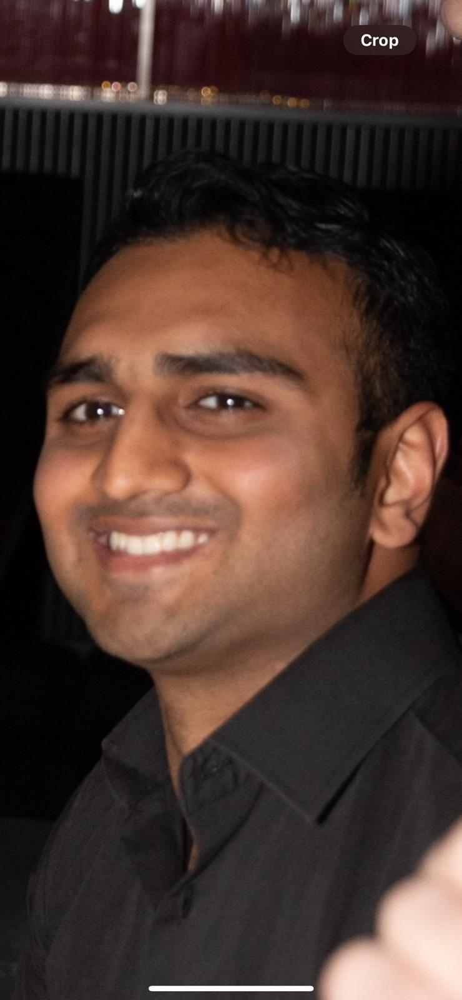
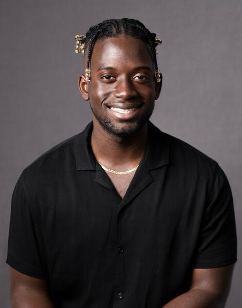
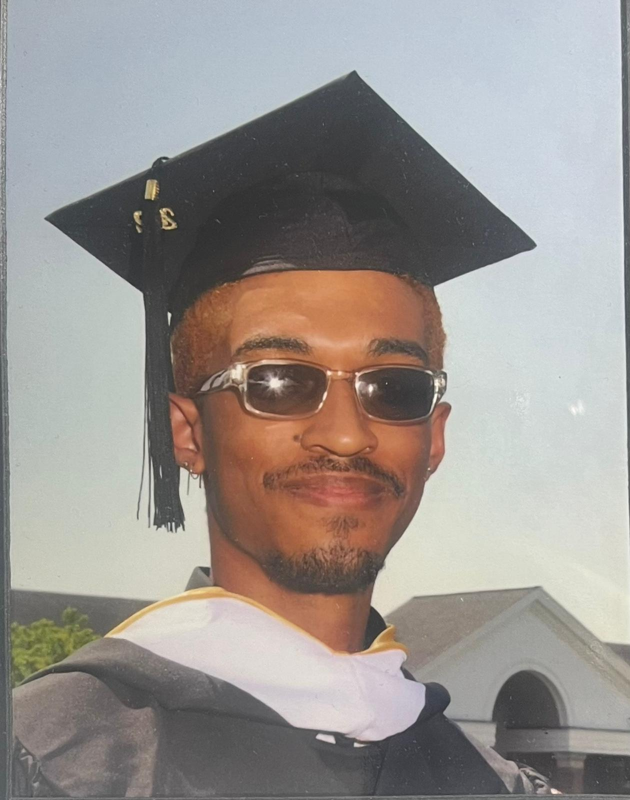

# 8020fit - Pace University Capstone Project

***

## Project Description

8020fit is a comprehensive web app designed to optimize nutrition and fitness tracking. End users will take in depth quiz on what the nutrition and fitness goals are as well as lifestyle habits as well as nutrition/food preferences. From there, they will put in their body measurements and goal body measurements and any other information. The AI will then create recommendations for you for diet and exercise. You will also be able to track weights added to workout, macros, etc. which will then create stunning visuals to give the end user a macro of their nutrition and fitness to see if they’re on track.

***

## Team FitForce Members

<table style="width:100%" border="0" cellspacing="0" cellpadding="0">
  <tr>
    <td align="center" valign="center"> Rohan Patel (<a href="mailto:student pace email id">rp59653n@pace.edu</a>)</td>
    <td align="center" valign="center"> Yaw Mensah (<a href="mailto:student pace email id">ym26692n@pace.edu</a>)</td>
    <td align="center" valign="center"> Mustafa Al-Tameemi (<a href="mailto:student pace email id">ma60965n@pace.edu</a>)</td>
  </tr>
  <tr>
    <td align="center" valign="center"> Miguel Lugo (<a href="mailto:student pace email id">ml76049p@pace.edu</a>)</td>
    <td align="center" valign="center"> Adrian Egasan (<a href="mailto:student pace email id">ae71253n@pace.edu</a>)</td>
     <td align="center" valign="center"> </td>
  </tr>
</table>